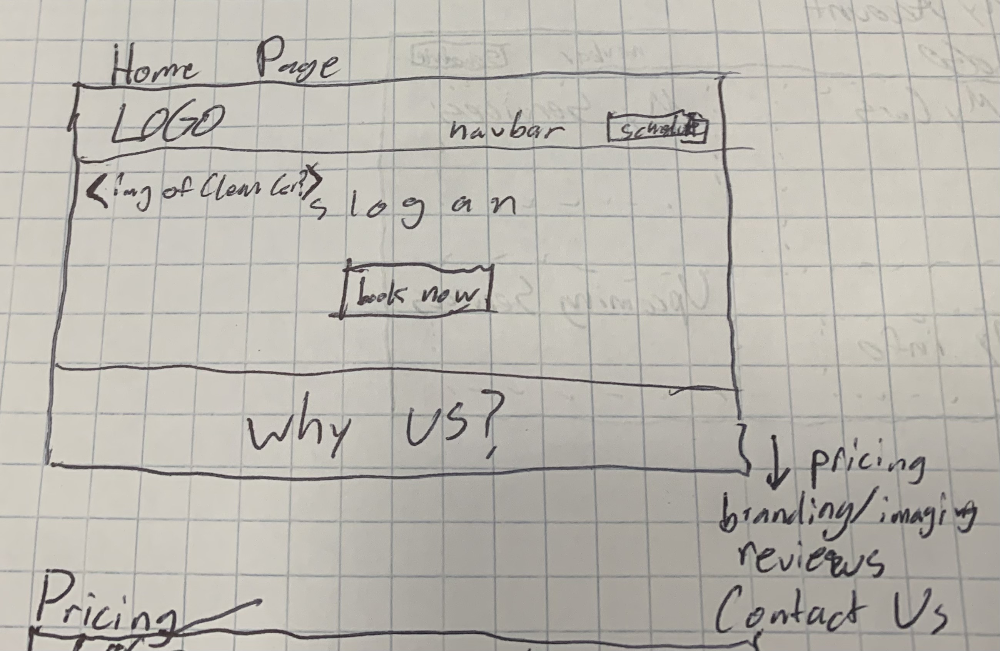
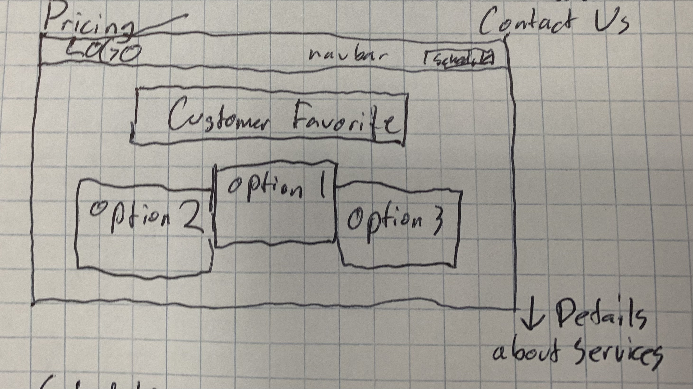
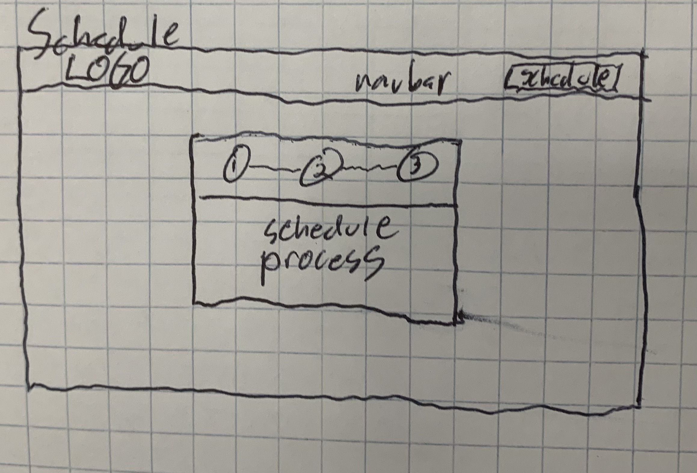
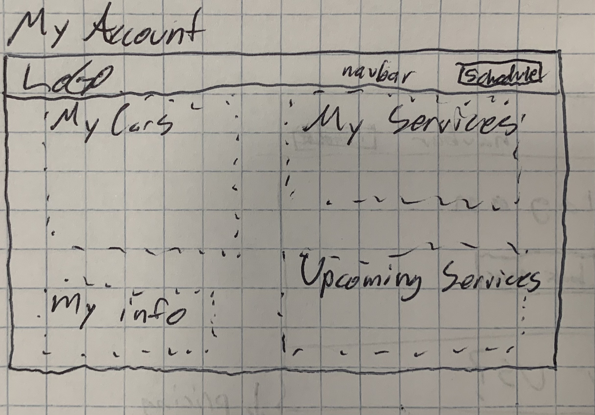
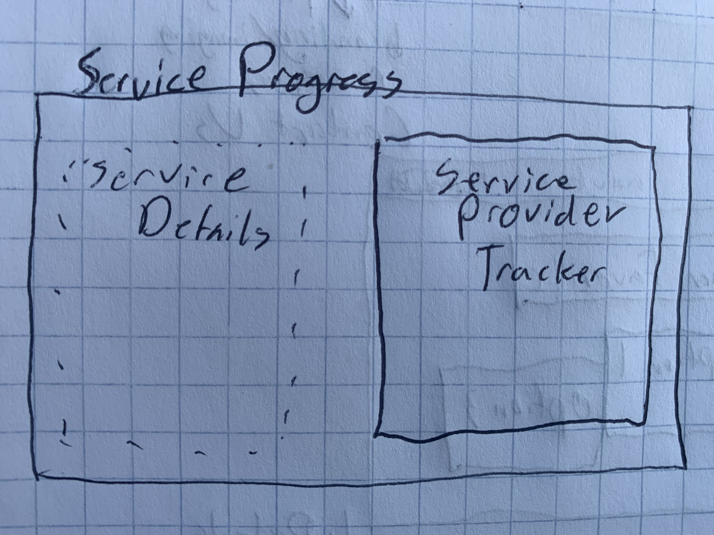

# CarDetailingSite
### Elevator Pitch
Small business owners face two significant issues, creating an effective and efficient 
order/fulfillment tracking process and creating a digital platform that establishes trust with the
end user and serves as a landing for any web generated leads. This product is a customizable website
for small business owners/hustlers that provides a subscription service platform to hook into our
website. As a proof of concept this website will be designed to cater to a small business that 
provides detailing services to professionals who commute to the office and leave their car in the
parking lot while they're working. Features will include a live update of the technicians location
just before and during time of service displayed on a map, as well as scheduling, pricing, and 
account creation.

## Design
### Landing Page

The home page will serve as an informational page for anyone landing on our website.
Key focuses of this page are to provide trustworthy branding and imaging and to communicate
our business model and competitive advantages.

### Pricing

This page will communicate the pricing of our services and allow users to leanr about the
how we structure our payments and services.

### Schedule a Clean

This page is a dynamic process card that sequentially collects the information necessary to 
schedule a clean as a customer.

### My Account

This page is the account management page and displays to the user the information we have
collected about them and gives them the ability to change it. It will also display scheduled
services

### Service Progress

This page displays the progress of a service and the location of the assigned technician 1 hour
before and during the fulfilling of the service. It also contains the details of the requested
service. On completion photos of the results will be viewable on this page.

## Technologies
### Authentication
I want to implement Google sign-in as well as native sign in. Usernames aren't really necessary
for this service so a unique identifier like a phone number or email will probably be substituted
here. The My Account and Service Progress pages will both be blocked by authentication.

### Websocket
The live location feed for the technician will require a websocket that feeds the web page with 
the technician's locaiton. I believe this could be provided by a mobile I could also simulate this
for testing.

### Database
This app will require many different data models. The apparent necessary models right now as
I see them are
* Service
* User
* Order

#### Service
Contains data describing each of the available services.

#### Order
Contains information about what orders a User has made and what the status of those order is

#### User
Contains all of the information about a user and any other relevant information related to their
account.